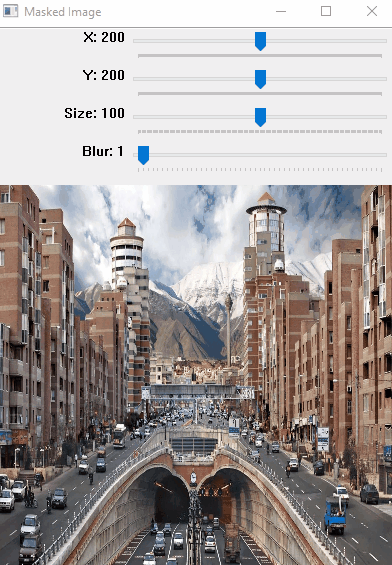

# FocusLens 🔍  
**Interactive Image Masking & Blurring Tool**  

 

## **✨ Features**  
- Adjustable **mask position** (X, Y) and **size** using sliders.  
- Control **blur intensity** dynamically.  
- Real-time updates for smooth interactivity.  
- Works on any image (just replace `beach.jpg`).  

## **🚀 How It Works**  
1. **Draws a white rectangle** (mask) on a black background.  
2. **Applies blur** to the entire image.  
3. **Combines** the original (inside the mask) + blurred (outside).  
